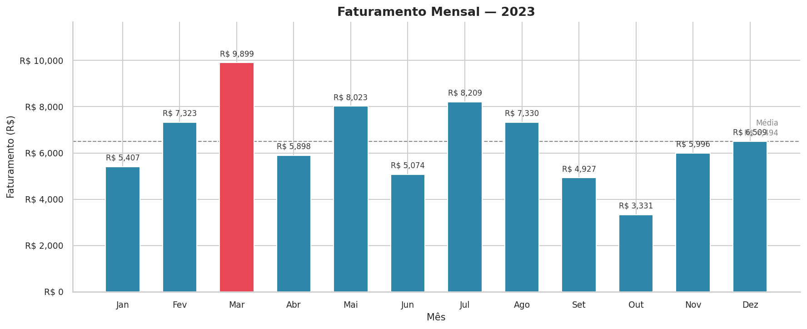
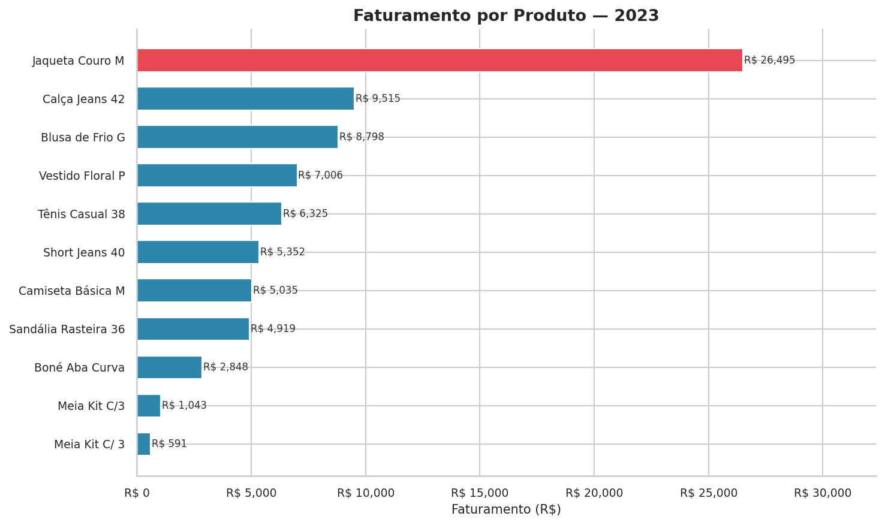
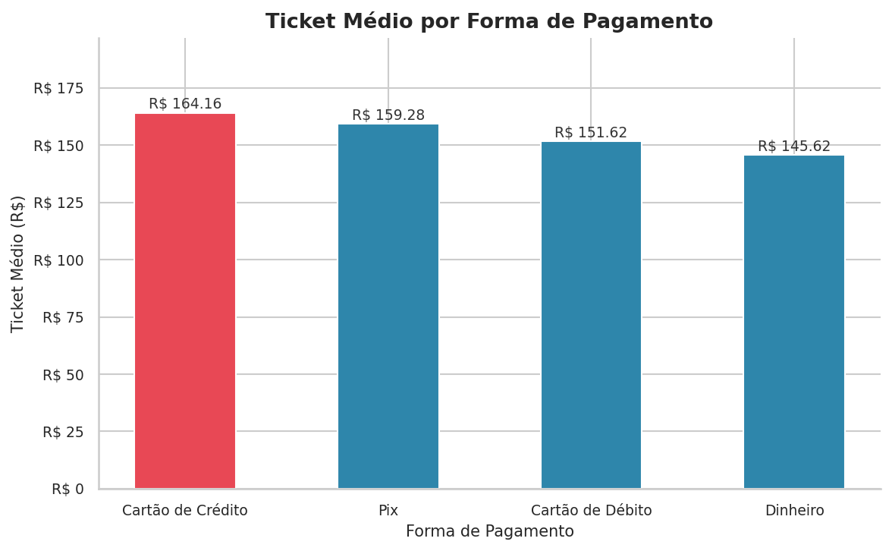
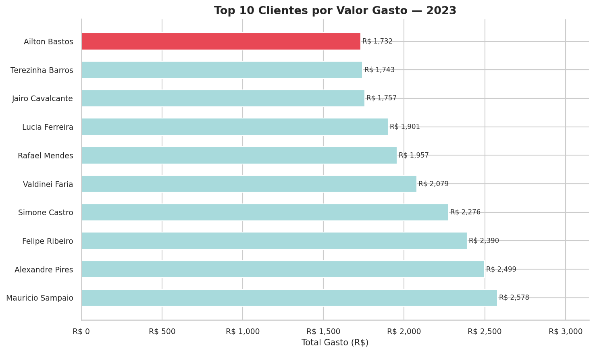
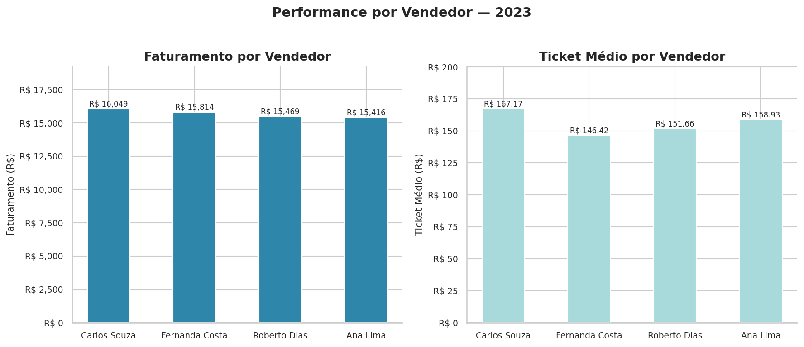
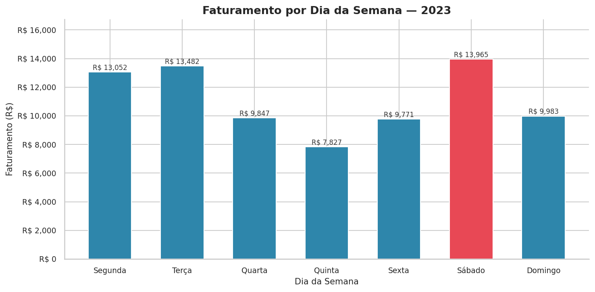

# Limpeza de Dados de Vendas — Loja de Moda

[](https://colab.research.google.com/github/ElielSf/loja-moda-limpeza-dados/blob/main/notebooks/01_limpeza_dados.ipynb)
[](https://colab.research.google.com/github/ElielSf/loja-moda-limpeza-dados/blob/main/notebooks/02_analise_indicadores.ipynb)

## Sobre o projeto

Uma loja de roupas e calçados acumulou um ano inteiro de registros de vendas em planilhas preenchidas manualmente. O resultado: **datas em formatos diferentes, produtos duplicados com grafias inconsistentes, preços inválidos e clientes cadastrados mais de uma vez**.

Este projeto simula esse cenário real e entrega um pipeline completo de limpeza e análise — transformando um arquivo bruto inutilizável em uma planilha organizada, indicadores de negócio e relatório visual pronto para uso.

---

## Problemas encontrados nos dados brutos

| Problema | Descrição | Volume estimado |
|---|---|---|
| Linhas duplicadas | Registros repetidos por erro de digitação | ~20 linhas |
| Datas inconsistentes | 5 formatos diferentes (`dd/mm/yyyy`, `yyyy-mm-dd`, etc.) | Todas as linhas |
| Produtos duplicados | Mesmo item com variações de caixa e acentuação | 10 produtos × 3 grafias |
| Preços inválidos | Nulos, zeros, negativos e vírgula como separador decimal | ~8% das linhas |
| Pagamento inconsistente | 4 grafias para a mesma forma de pagamento | Todas as linhas |
| Clientes inconsistentes | Nomes em caixa alta misturados com normal | ~15% das linhas |
| Vendedor nulo | Registro sem identificação do vendedor | ~10% das linhas |

---

## Pipeline do projeto

```
Dados brutos (CSV sujo)
        │
        ▼
[Notebook 01 — Limpeza]
  1. Remoção de duplicatas exatas
  2. Padronização de datas → formato único datetime
  3. Padronização de produtos → nome canônico
  4. Limpeza de preços → conversão, remoção de inválidos, imputação por mediana
  5. Padronização de forma de pagamento e nome de cliente
  6. Criação de colunas auxiliares (valor_total, mês, dia da semana)
        │
        ▼
Dataset limpo (.csv + .xlsx)
        │
        ▼
[Notebook 02 — Análise e Visualização]
  1. Visão geral do negócio (faturamento, ticket médio, clientes)
  2. Faturamento mensal com variação percentual
  3. Top produtos por faturamento e participação
  4. Ticket médio por forma de pagamento
  5. Top 10 clientes por valor gasto
  6. Performance por vendedor
  7. Faturamento por dia da semana
        │
        ▼
Indicadores (.csv) + Relatório visual (gráficos)
```

---

## Resultado da limpeza

| | Antes | Depois |
|---|---|---|
| Linhas | 520 | ~500 |
| Formatos de data | 5 | 1 |
| Grafias por produto | até 4 | 1 |
| Preços inválidos | ~8% | 0% |
| Nulos em vendedor | ~10% | 0% |

---

## Relatório visual

### Faturamento Mensal


### Top Produtos por Faturamento


### Ticket Médio por Forma de Pagamento


### Top 10 Clientes por Valor Gasto


### Performance por Vendedor


### Faturamento por Dia da Semana


---

## Estrutura do repositório

```
loja-moda-limpeza-dados/
│
├── data/
│   ├── raw/
│   │   └── vendas_brutas_loja_moda.csv        ← dataset sujo original
│   ├── processed/
│   │   ├── vendas_limpas_loja_moda.csv         ← dataset limpo
│   │   └── vendas_limpas_loja_moda.xlsx        ← entrega ao cliente
│   └── indicators/
│       ├── fat_mensal.csv
│       ├── top_produtos.csv
│       ├── ticket_pagamento.csv
│       ├── top_clientes.csv
│       ├── perf_vendedor.csv
│       └── vendas_dia.csv
│
├── notebooks/
│   ├── 01_limpeza_dados.ipynb                  ← geração do dataset e limpeza
│   └── 02_analise_indicadores.ipynb            ← análise, indicadores e gráficos
│
├── reports/
│   └── graficos/
│       ├── 01_faturamento_mensal.png
│       ├── 02_top_produtos.png
│       ├── 03_ticket_pagamento.png
│       ├── 04_top_clientes.png
│       ├── 05_performance_vendedor.png
│       └── 06_vendas_dia_semana.png
│
├── .gitignore
└── README.md
```

---

## Tecnologias utilizadas

- Python 3.10+
- pandas
- numpy
- python-dateutil
- matplotlib
- seaborn
- openpyxl

---

## Como reproduzir

1. Clone o repositório:
```bash
git clone https://github.com/ElielSf/loja-moda-limpeza-dados.git
```

2. Instale as dependências:
```bash
pip install pandas numpy python-dateutil matplotlib seaborn openpyxl
```

3. Execute os notebooks na ordem:
   - `01_limpeza_dados.ipynb` → gera o dataset limpo em `data/processed/`
   - `02_analise_indicadores.ipynb` → gera os indicadores em `data/indicators/` e os gráficos em `reports/graficos/`

Ou abra direto no Google Colab pelos botões no topo deste README.

---

## Sobre este projeto

Este projeto faz parte do meu portfólio de análise de dados, com foco em **limpeza e organização de dados para pequenos negócios**.

Se você tem planilhas desorganizadas e precisa transformá-las em informação útil, entre em contato:

- GitHub: [ElielSf](https://github.com/ElielSf)
- LinkedIn: [Eliel Souza](https://linkedin.com/in/eliel-souza-ferreira)
